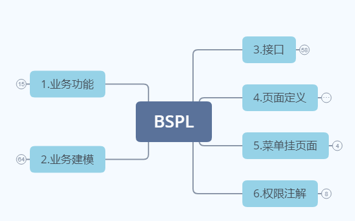

<h1 align="center" style="margin: 30px 0 30px; font-weight: bold;">若依零代码平台</h1>
<h4 align="center">基于若依平台实现零代码平台，旨在于：通过不用接触代码，就能实现业务功能，人人都是程序员，编程变成拖程，是一件快乐事情！</h4>

## 平台简介

* 本平台，由两大底座构成：
1. 零代码业务平台
   平台功能xmind图: 

 
1. 这里是列表文本   业务平台由业务功能，业务建模，接口定义，页面定义，菜单挂页面，权限注解 六大模块组成 
业务功能: 

业务功能是树状结构，后面业务模型，接口，页面都是挂在业务功能节点上。方面后面过滤选择，符合业务人员习惯 