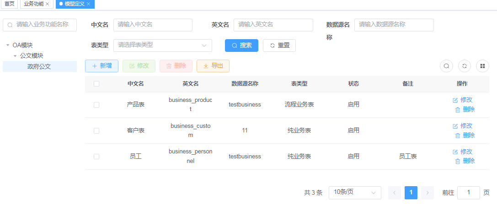

<h1 align="center" style="margin: 30px 0 30px; font-weight: bold;">若依零代码平台</h1>
<h4 align="center">基于若依平台实现零代码平台，旨在于：通过不用接触代码，就能实现业务功能，人人都是程序员，编程变成拖程，是一件快乐事情！</h4>
如有问题可以加我微信号lita2lz或扫码：  

 
## 平台简介

* 本平台由两大底座构成：
1.  **零代码业务平台** 
   平台功能xmind图: 

 
1. 业务平台由业务功能，业务建模，接口定义，页面定义，菜单挂页面，权限注解 六大模块组成 
**业务功能** : 

 
业务功能是树状结构，后面业务模型，接口，页面都是挂在业务功能节点上。方便后面过滤选择，符合业务人员习惯 
 **业务建模** ： 

 

 

 

 

 

 

 业务建模就是创建业务存放的数据表,包括选择数据源，表名，字段名 
 **接口定义** : 

 

 
接口定义就是后台暴露的API，分为通用URL和自定义URL.比如新增，修改，删除，查询都可以弄成通用URL，只是传参不同而已.
 
 **页面定义** : 

 

 

 

 

 

 
页面定义比较复杂，尚未完全完成。设计页面设计，页面接口，页面参数三大块。 
目前正在丰富组件，以便能串通一个基本页面功能维护! 
2.  **零代码流程平台** 
功能图: 

 
流程是基于业务平台基础上，利用业务平台业务功能，再加上flowable流程能力，实现完全可视化功能。所以必须等业务平台完毕后，才能启动，敬请期待！